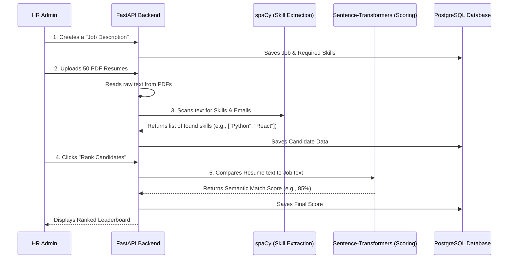

# SmartHire AI: How It Actually Works

This document explains the "Brain" of the SmartHire system we just built in simple terms.

## 1. The Core Workflow

When the frontend dashboard is eventually built, this is exactly what happens behind the scenes when an HR manager clicks a button:

---

## 2. Our Technology Choices (What, Why, and Alternatives)

As a senior developer, you have to make choices. Here is why we picked our current stack compared to the alternatives:

### **The Web Server: FastAPI**
* **What it does:** It listens for network requests (like file uploads) and routes them to our Python code.
* **Why we chose it:** It is `asynchronous`. If 10 people upload resumes at the exact same second, FastAPI handles them all simultaneously without freezing.
* **The Alternative:** *Flask or Django.* Flask processes requests one-at-a-time (synchronously). If a 10-page resume takes 5 seconds to process, the entire server freezes for everyone else for 5 seconds.

### **The Database: PostgreSQL**
* **What it does:** Permanently stores our Users, Jobs, Candidates, and Scores.
* **Why we chose it:** It supports `JSONB` columns. Since every resume has a totally different, unpredictable amount of skills and education history, we can store them flexibly inside a rigid, secure relational database.
* **The Alternative:** *SQLite or MongoDB.* SQLite is too weak and locks the file when multiple people write to it. MongoDB is great for flexible data, but terrible at handling relational links (like linking Candidate #5 to Job #10).

### **The Skill Extractor: spaCy**
* **What it does:** Named Entity Recognition (NER). It reads a giant block of text and understands *what* the words mean (e.g., it knows "Java" is a skill, not coffee).
* **Why we chose it:** It is the industry standard for fast, production-ready NLP parsing.
* **The Alternative:** *Regular Expressions (Regex) or NLTK.* Regex is too rigid (you'd have to manually type every variation of every skill in the world). NLTK is too academic and slow.

### **The Scoring Engine: Sentence-Transformers**
* **What it does:** It turns English sentences into mathematical coordinates to see how "close" they mean the same thing.
* **Why we chose it:** It understands **context**. If a resume says "Created web apps" and the job asks for "Built web platforms", it knows they mean the exact same thing and gives a 99% score.
* **The Alternative:** *TF-IDF (Term Frequency).* This is an older algorithm that only looks for exact word matches. If it doesn't see the exact word "apps", it gives a 0% score.

### **The File Reader: pdfplumber**
* **What it does:** Rips text out of PDF files.
* **Why we chose it:** Resumes are notoriously messy (they use invisible columns, weird margins, and strange fonts). `pdfplumber` is incredibly smart at reading left-to-right columns correctly.
* **The Alternative:** *PyPDF2.* It often jumbles text together if the resume has two columns, combining the left column's sentence directly into the right column's sentence, ruining the AI analysis.

---

## 3. Demystifying the Swagger UI

Swagger looks overwhelming because it shows you the raw database structure required for the API. In reality, our system only has **3 simple actions**:

1. **`POST /jobs`** 
   * **What it means:** Tell the database what we are hiring for.
   * **What you give it:** A title ("Nurse") and required skills (["CPR", "Patient Care"]).
2. **`POST /candidates/upload`**
   * **What it means:** Hand the server a PDF. The AI reads it, finds the skills, and remembers the candidate.
3. **`POST /jobs/{job_id}/score/{candidate_id}`**
   * **What it means:** "Hey AI, look at Job #1 and Candidate #1. Do the math and tell me if they are a good match."
